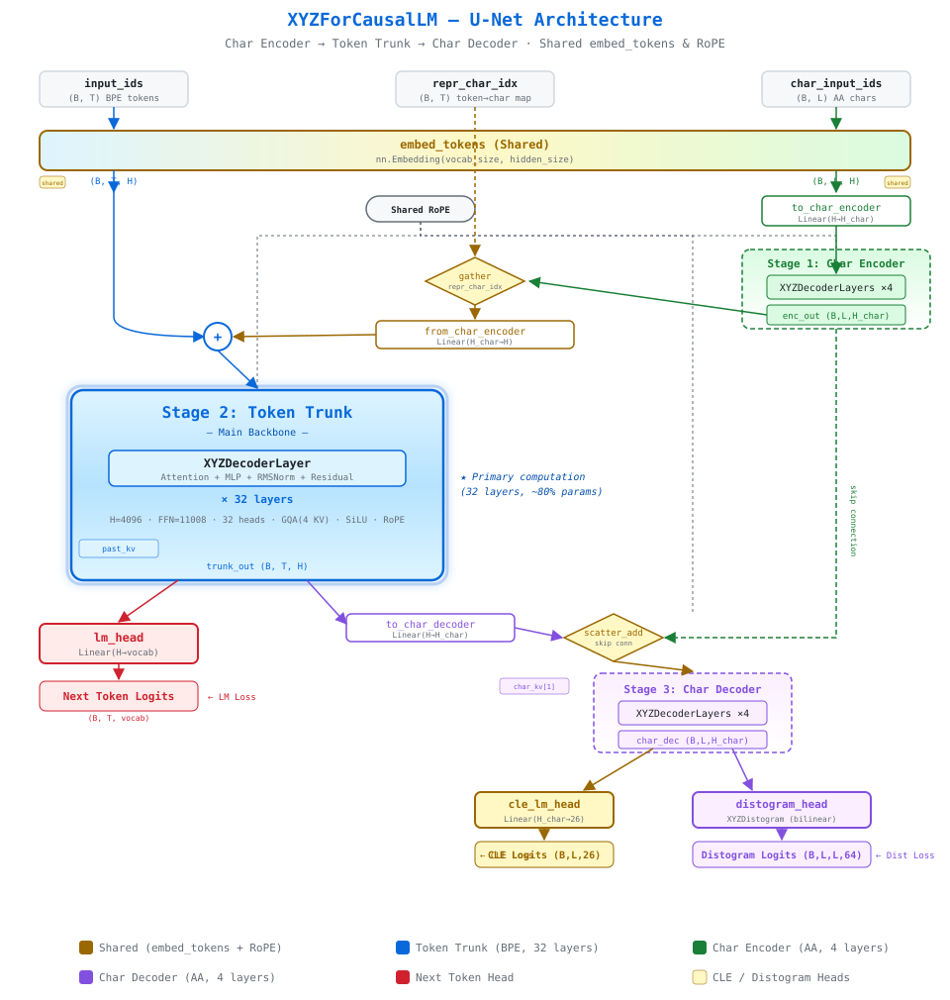

# ProXYZ


[](https://conventionalcommits.org)


A protein language model pre-training framework built on DeepSeek-style Llama blocks, featuring a **U-Net style dual-granularity architecture** with **structure-aware auxiliary heads** (CLE and distogram) and Fill-in-the-Middle training.

## Overview

ProXYZ pre-trains protein language models that jointly learn sequence and structural signals:

- **U-Net style dual-granularity model (`XYZForCausalLM`)** — a character-granularity transformer stack feeds into a BPE-token-granularity transformer trunk, whose output is decoded back to character granularity with U-Net skip connections.
- **Structure-aware auxiliary heads** — on top of the character decoder, the model predicts:
  - **CLE** (Cα-Local-Environment, 26 structure-letter alphabet) per residue
  - **Distogram** — pairwise residue–residue distance distributions (64 bins)
- **Next-token prediction** — the token trunk carries the standard causal LM head.
- **Fill-in-the-Middle (FIM) training** — DeepSeek-Coder style SPM/PSM infilling for bidirectional context.
- **Cluster-based sampling** — weighted sampling (`n / (1 + log n)` by cluster size) to balance sequence-cluster diversity.
- **HuggingFace integration** — train from local files (`line` / `fasta` / `pdb`) or HuggingFace Hub datasets.
- **Separate loss tracking** — monitor standard vs. FIM loss, and each auxiliary loss, independently.

## Architecture

<p align="center">
  
</p>

`XYZForCausalLM` is a three-stage U-Net over a shared `embed_tokens` and shared RoPE:

1. **Char encoder** — small transformer stack at amino-acid (character) granularity.
2. **Token trunk** — the main transformer stack at BPE-token granularity (32 layers by default). Encoder output is gathered at representative character positions (`repr_char_idx`), projected back, and added to the token embeddings.
3. **Char decoder** — character-granularity stack receiving the trunk output via `scatter_add` plus a U-Net skip connection from the encoder.

Three prediction heads sit on this backbone:

| Head | Input | Output | Role |
|------|-------|--------|------|
| `lm_head` | trunk output (B, T, H) | next-token logits (B, T, vocab) | causal LM objective |
| `cle_lm_head` | char decoder output (B, L, H_char) | CLE logits (B, L, 26) | per-residue local structure |
| `distogram_head` | char decoder output (B, L, H_char) | distance logits (B, L, L, 64) | pairwise residue distances |

The total loss is the next-token CE plus the auxiliary CLE / distogram CEs.

> **Note on "char level":** the character path is a *deterministic* BPE tokenization (BPE dropout = 0), not per-character tokenization. The processor runs the tokenizer twice — once with BPE dropout (training regularization) and once without (for alignment between the two granularities).

## Installation

```bash
git clone https://github.com/bigict/ProXYZ.git
cd ProXYZ

pip install torch transformers datasets click biotite biopython

# Optional: flash attention for best performance
pip install flash-attn --no-build-isolation
```

## Quick Start

### Training

Basic training with local data (standard Llama backbone):
```bash
bash train.sh protein_seqs.txt
```

FASTA input:
```bash
bash train.sh seqs.fasta --data_format fasta
```

Train the U-Net model with all auxiliary heads:
```bash
bash train.sh seqs.fasta --data_format fasta \
  --model_has_cle_lm_head \
  --model_has_distogram_lm_head \
  --model_has_char_lm_head \
  --model_char_hidden_size 768 \
  --model_char_intermediate_size 2064 \
  --model_char_num_hidden_layers 2 \
  --model_char_num_attention_heads 6
```

Train from a HuggingFace dataset:
```bash
PYTHONPATH=src python src/proxyz/train.py \
  --dataset_name your-dataset/name \
  --dataset_split train \
  --text_column sequence \
  --tokenizer_file uniref90_30000.json
```

### Structure-aware training (PDB)

With `--data_format pdb`, CLE labels and distogram labels are derived from
experimental structures: per-protein preprocessed tensors are loaded from
`$DATA_PATH/processed/<id>.pt`, CLE letters are encoded from backbone /
Cβ coordinates (biotite `i3d` alphabet), and distogram targets are
pseudo-β (Cβ, Cα for Gly) pairwise distances binned into 64 bins over
~2.3–21.7 Å.

```bash
DATA_PATH=/path/to/pdb_data bash train.sh pdb_list.csv \
  --data_format pdb \
  --model_has_cle_lm_head \
  --model_has_distogram_lm_head
```

### Fill-in-the-Middle (FIM) Training

```bash
# 50% FIM, 50% standard training
bash train.sh protein_seqs.txt --fim_rate 0.5

# 100% FIM (DeepSeek-Coder style), SPM/PSM mixed
bash train.sh protein_seqs.txt --fim_rate 1.0 --fim_spm_rate 0.5
```

Formats:
- **SPM**: `<BOS><fim_suffix><suffix><fim_prefix><prefix><fim_middle><middle><EOS>`
- **PSM**: `<BOS><fim_prefix><prefix><fim_suffix><suffix><fim_middle><middle><EOS>`

### Cluster-based Sampling

```bash
bash train.sh protein_seqs.txt --cluster_files clusters.txt
```

Cluster file format (two columns: cluster_id, data_row_id). Sampling weight
per cluster: `n / (1 + log n)` where `n` is cluster size.

### Validation & Resuming

```bash
bash train.sh train.txt \
  --eval_files val.txt \
  --eval_strategy steps \
  --eval_steps 500 \
  --resume_from_checkpoint
```

`--resume_from_checkpoint` restores model weights, optimizer state, LR
scheduler, and the training step from the latest checkpoint in `--output_dir`.

### Sequence Generation

```bash
bash generate.sh                                    # 10 seqs x 100 tokens
bash generate.sh --num_sequences 50 --num_tokens 512
bash generate.sh --prompt MVSKGE --temperature 0.8  # seeded generation
bash generate.sh --force_length --num_tokens 256    # exact length, ignore [EOS]
```

Generated sequences are written as a timestamped FASTA under `--output_dir`
(default `./generated_sequences`). Tokens containing `X` (unknown residue)
are suppressed.

### Evaluation with ESMFold

Fold generated FASTA files with ESMFold to inspect structural quality:

```bash
PYTHONPATH=src python src/proxyz/evaluate.py generated_*.fasta \
  --output_dir ./esmfold_pdbs
```

## Training Options

### Model architecture
- `--model_hidden_size` (2048), `--model_intermediate_size` (5632),
  `--model_num_hidden_layers` (24), `--model_num_attention_heads` (16),
  `--model_num_key_value_heads` (4, GQA)
- `--model_char_hidden_size` (768), `--model_char_intermediate_size` (2064),
  `--model_char_num_hidden_layers` (2), `--model_char_num_attention_heads` (6)
- `--model_has_char_lm_head` / `--model_has_cle_lm_head` / `--model_has_distogram_lm_head`: enable auxiliary heads
- `--model_use_char_position_ids`: gather token positions from char positions via `repr_char_idx`
- `--max_position_embeddings` (4096)

### Data
- `--data_format`: `line` | `fasta` | `pdb`
- `--tokenizer_file`: BPE tokenizer JSON
- `--tokenizer_bpe_dropout`: stochastic BPE regularization rate
- `--max_sequence_length`: random-crop threshold for long sequences
- `--text_column` (text), `--dataset_name` / `--dataset_config` / `--dataset_split` / `--dataset_eval_split` for HuggingFace Hub
- `--cluster_files`: cluster-based sampling files

### FIM
- `--fim_rate` (0.0), `--fim_spm_rate` (0.5), `--fim_sft_style` (loss only after `<fim_middle>`)

### Optimization
- `--learning_rate` (3e-4), `--weight_decay` (0.1), `--warmup_steps` (0)
- `--num_train_epochs` (3.0), `--max_steps` (-1),
  `--per_device_train_batch_size` (4), `--gradient_accumulation_steps` (8)

### Logging & checkpointing
- `--output_dir`, `--logging_steps` (10), `--save_steps` (500)
- `--report_to` (swanlab, tensorboard), `--run_name`, `--logging_dir`
- `--resume_from_checkpoint`

### Performance
- `--attn_implementation`: `flash_attention_2` | `sdpa` | `eager`
- `--dataloader_num_workers` (4)

## Project Structure

```
ProXYZ/
├── src/proxyz/
│   ├── train.py               # Training entry point
│   ├── generate.py            # Sequence generation
│   ├── evaluate.py            # ESMFold evaluation of generated sequences
│   ├── classify.py            # Token classification
│   ├── models/
│   │   ├── configuration_xyz.py   # XYZConfig
│   │   ├── modeling_xyz.py        # XYZForCausalLM (U-Net + heads)
│   │   ├── modular_xyz.py         # modular source of truth
│   │   └── processing_xyz.py      # processor implementation
│   ├── data/                  # dataset iterators, PDB feature extraction, sampler
│   └── utils/
├── script_utils/              # tokenizer / id-mapping / FIM utilities
├── assets/                    # architecture diagram (svg / html)
├── (train|generate|classify).sh   # wrapper scripts
└── README.md
```

## Requirements

- Python 3.9+
- PyTorch 2.0+
- transformers 4.40+
- datasets, click
- biotite, biopython (PDB / structure features)
- flash-attn (optional, recommended)

## License

MIT License — see [LICENSE](LICENSE) for details.

## Citation

```bibtex
@software{proxyz2026,
  title = {ProXYZ: Protein Language Model Pre-training Framework},
  author = {bigict},
  year = {2026},
  url = {https://github.com/bigict/ProXYZ}
}
```

## Acknowledgments

- [DeepSeek-Coder](https://github.com/deepseek-ai/DeepSeek-Coder) for FIM training methodology
- [HuggingFace Transformers](https://github.com/huggingface/transformers) for the training framework
